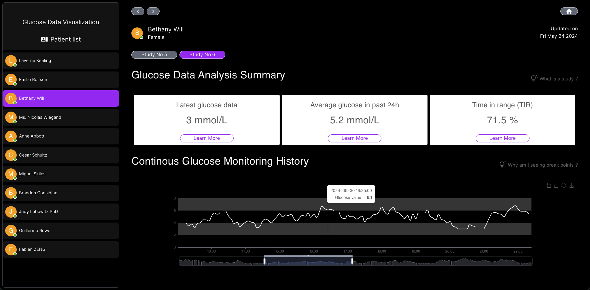

# What is this project ?
Live demo : [Vercel](https://data-vis-demo.vercel.app/)

This project is being continuously updated, a one-week sprint is scheduled, thus live demo will be released each Saturday.

For previous release : [Releases](./ReleaseNote.md)

## Tech Stack

This is a personal project I use to document my own learning of [Next.js](https://nextjs.org/docs) & AWS services ([API Gateway](https://aws.amazon.com/api-gateway/?nc2=type_a), [Lambda](https://aws.amazon.com/lambda/?nc2=type_a), [DynamoDB](https://aws.amazon.com/dynamodb/?nc2=type_a)) and practice with [React](https://react.dev/reference/react), [TypeScript](https://www.typescriptlang.org/docs/handbook/typescript-in-5-minutes.html), [Express.js](https://expressjs.com/), [Redux](https://redux.js.org/introduction/getting-started), [Tailwind CSS](https://tailwindcss.com/docs/installation), [Echarts](https://echarts.apache.org/handbook/zh/get-started/), [Jest](https://jestjs.io/docs/getting-started), [JSON Web Token](https://jwt.io/), and [webpack](https://webpack.js.org/concepts/) !

If necessary, I will later integrate [PostgreSQL](https://www.postgresql.org/docs/current/), [Drizzle ORM](https://orm.drizzle.team/docs/overview). For now, I will only use all the AWS services mentioned above to provide RESTful API for this project. 




Responsive to mobile device


## Importance of code annotation

I've put a lot of emphasis on the annotations in this project, both for me to review what I've learnt and for other beginners to be inspired by this open-source project.

# Instruction for use

This is a [Next.js](https://nextjs.org/) project bootstrapped with [`create-next-app`](https://github.com/vercel/next.js/tree/canary/packages/create-next-app).

## Getting Started

First, run the development server:

```bash
npm run dev
# or
yarn dev
# or
pnpm dev
# or
bun dev
```

Open [http://localhost:3000](http://localhost:3000) with your browser to see the result.

You can start editing the page by modifying `app/page.tsx`. The page auto-updates as you edit the file.

This project uses [`next/font`](https://nextjs.org/docs/basic-features/font-optimization) to automatically optimize and load Inter, a custom Google Font.

## Learn More

To learn more about Next.js, take a look at the following resources:

- [Next.js Documentation](https://nextjs.org/docs) - learn about Next.js features and API.
- [Learn Next.js](https://nextjs.org/learn) - an interactive Next.js tutorial.

You can check out [the Next.js GitHub repository](https://github.com/vercel/next.js/) - your feedback and contributions are welcome!

## Deploy on Vercel

The easiest way to deploy your Next.js app is to use the [Vercel Platform](https://vercel.com/new?utm_medium=default-template&filter=next.js&utm_source=create-next-app&utm_campaign=create-next-app-readme) from the creators of Next.js.

Check out our [Next.js deployment documentation](https://nextjs.org/docs/deployment) for more details.
